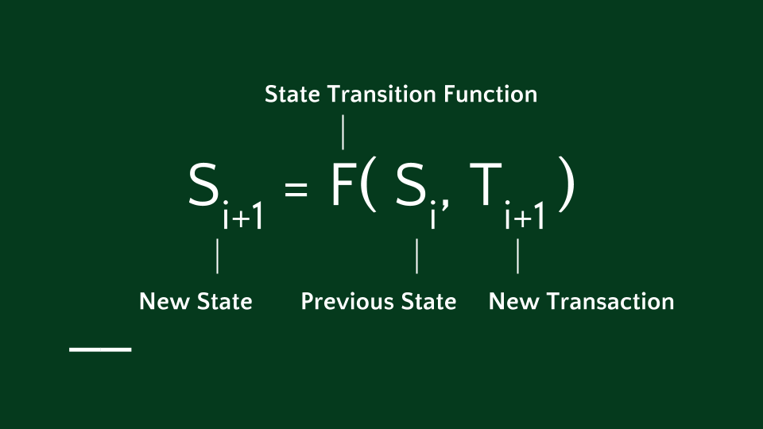
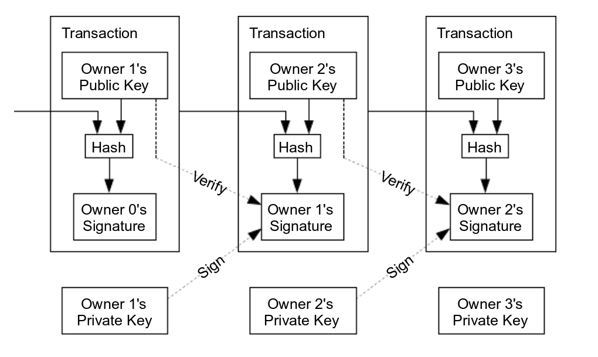
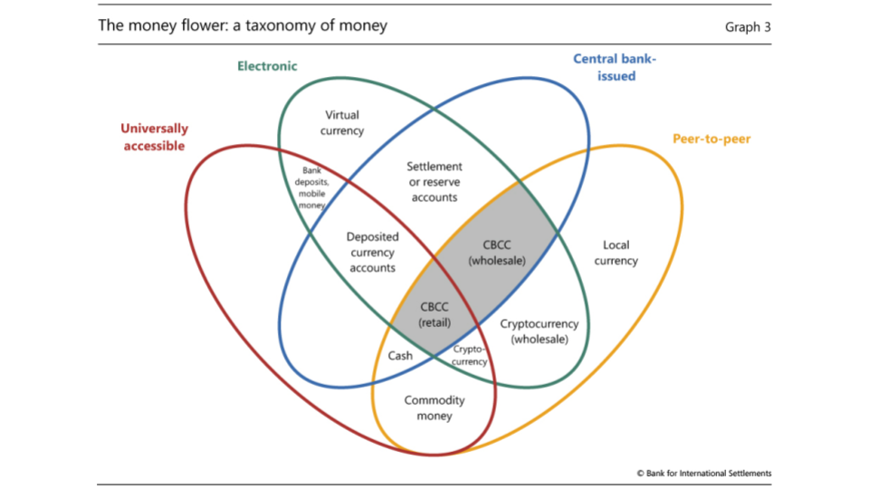
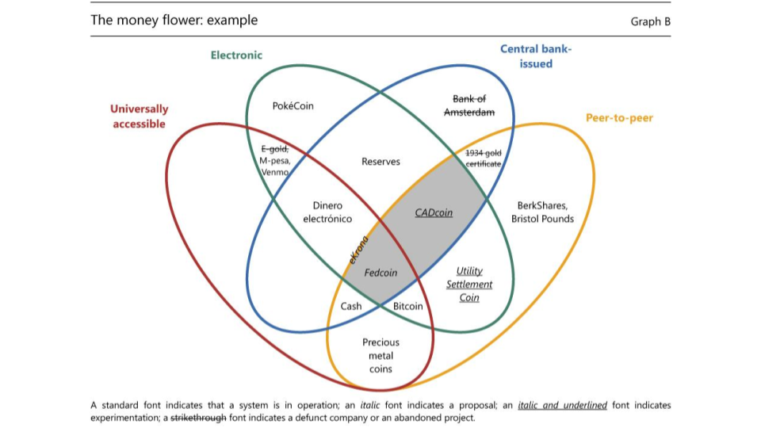
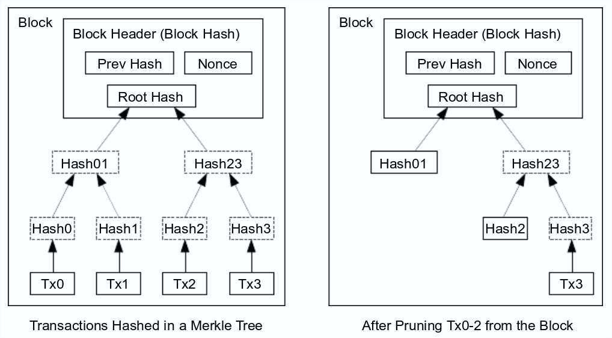

### Understanding *Blockchain* with *Go*
<br>
<br>
<span style="font-size: 50%">Guilherme Rezende - Globo.com</span>
<br>
<span style="font-size: 50%">Raphael Guarilha - Stone Pagamentos</span>

---

### What is Bitcoin?

Bitcoin is a Peer-to-Peer Electronic Cash System that uses a peer-to-peer network to solve the double-spending problem.

+++

> “This system can be said to be a very specialised version of a cryptographically secure, transaction-based state machine”

+++



---

### The world-famous Blockchain

We define an electronic coin as a chain of digital signatures.

Each owner transfers the coin to the next by digitally signing a hash of the previous transaction and the public key of the next owner and adding these to the end of the coin.

+++



+++

As most cases of overnight success, Bitcoin has 30+ years in the making.

+++?image=assets/WjIt38I.jpg&size=auto 90%

---

## Regulation

3 key characteristics of cryptocurrencies:

1. they are electronic
1. are not the liability of anyone
1. and feature peer-to-peer exchange

+++

Cash is peer-to-peer, but it is not electronic, and it is a Central Bank liability.

Commercial bank deposits are a liability of the bank that issues them.

---

### Taxonomy of Money

The taxonomy of money is based on four key properties:

1. issuer (central bank or other);
1. form (electronic or physical);
1. accessibility (universal or limited);
1. and transfer mechanism (centralized or decentralized).

+++

### The money flower: taxonomy



+++

### The money flower: example



---

### Basic Blockchain

---

### Block

```go
type Block struct {
	Timestamp   time.Time
	PrevBlock   []byte
	Hash        []byte
	Data        []byte
}
```
@[2](The timestamp when the block is created)
@[3](Hash of the previous block)
@[4](Hash of the block)
@[5](Valuable information)

+++

#### New Block

```go
func NewBlock(data string, prevBlockHash []byte) *Block {
	return &Block{
		Timestamp: time.Unix(time.Now().Unix(), 0),
		PrevBlock: prevBlockHash,
		Data:      []byte(data),
		Hash:      []byte{},
	}
}
```
@[2-7]
@[3](Elapsed time since January 1, 1970 UTC.)
@[4]
@[5](Data provided by user)
@[6](Empty hash)

+++

#### Hash

```go
func (b *Block) setHash() {
	timestampStr := strconv.FormatInt(b.Timestamp.Unix(), 10)

	headers := bytes.Join([][]byte{
		b.PrevBlockHash,
		b.Data,
		[]byte(timestampStr),
	}, []byte{})

	hash := sha256.Sum256(headers)
	b.Hash = hash[:]
}
```
@[2](Wolololo)
@[4-8](Put fields together to be hashed)
@[10](Generate the SHA256 hash of the block)
@[11]
+++

### Blockchain

+++

```go
type Blockchain struct {
	blocks []*Block
}

func (bc *Blockchain) AddBlock(data string) {
	prevBlock := bc.blocks[len(bc.blocks)-1]
	newBlock := NewBlock(data, prevBlock.Hash)
	bc.blocks = append(bc.blocks, newBlock)
}
```
@[1-3]
@[5-9]
@[6](Get the last block in Blockchain)
@[7](Create a new block passing the hash of last block)
@[8](Append new block to blockchain)

+++

#### Genesis Block

```go
type Blockchain struct {
	blocks []*Block
}

func NewBlockchain() *Blockchain {
	genesis := NewBlock("The Genesis Block", []byte{})
	return &Blockchain{[]*Block{genesis}}
}

func (bc *Blockchain) AddBlock(data string) {
	prevBlock := bc.blocks[len(bc.blocks)-1]
	newBlock := NewBlock(data, prevBlock.Hash)
	bc.blocks = append(bc.blocks, newBlock)
}
```
@[5-8](In the beginning God created the heaven and the earth...)
@[6]
+++

#### Bitcoin Genesis Block

```c
// Genesis block
const char* pszTimestamp = "The Times 03/Jan/2009 Chancellor on brink of second bailout for banks";
CTransaction txNew;
txNew.vin.resize(1);
txNew.vout.resize(1);
txNew.vin[0].scriptSig = CScript() << 486604799 << CBigNum(4) << vector<unsigned char>((const unsigned char*)pszTimestamp, (const unsigned char*)pszTimestamp + strlen(pszTimestamp));
txNew.vout[0].nValue = 50 * COIN;
CBigNum bnPubKey;
bnPubKey.SetHex("0x5F1DF16B2B704C8A578D0BBAF74D385CDE12C11EE50455F3C438EF4C3FBCF649B6DE611FEAE06279A60939E028A8D65C10B73071A6F16719274855FEB0FD8A6704");
txNew.vout[0].scriptPubKey = CScript() << bnPubKey << OP_CHECKSIG;
CBlock block;
block.vtx.push_back(txNew);
block.hashPrevBlock = 0;
block.hashMerkleRoot = block.BuildMerkleTree();
block.nVersion = 1;
block.nTime    = 1231006505;
block.nBits    = 0x1d00ffff;
block.nNonce   = 2083236893;
```
@[2]("The Times 03/Jan/2009 Chancellor on brink of second bailout for banks")

+++?image=assets/bitcoin_genesis.jpg&size=auto 90%

---

### Transactions

+++

```go
type Transaction struct {
   Output    string
   Input      string
   Value      int64
}
```
@[2](where coins are actually stored)
@[3](address that will receive the value)
@[4](Amount transfered)

+++

#### Refactoring

```go
type Block struct {
   Timestamp    time.Time
   PrevBlock    []byte
   Hash         []byte
   Transactions []Transaction
}
```
@[5](s/Data/Transactions)

+++

#### Refactoring

```go
type Blockchain struct {
	blocks []*Block
	transactions []Transaction
}

func (bc *Blockchain) NewTransaction(tx Transaction) {
   bc.transactions = append(bc.transactions, tx)
}
```
@[3](Transactions to be added in the next block)
@[6-8](Append transaction)

+++

#### Refactoring

```go
func NewBlock(txs []Transactions, prevBlockHash []byte) *Block {
	return &Block{
		Timestamp:      time.Unix(time.Now().Unix(), 0),
		PrevBlock:      prevBlockHash,
		Transactions:   txs,
		Hash:           []byte{},
	}
}
```
@[5](s/Data/Transactions)

---

## Innovation

Cryptocurrencies utilize Distributed Ledger Technology (blockchain) to allow remote peer-to-peer transfer of electronic value in the absence of trust between contracting parties.

- No trusted intermediary clears and settles transactions |
- Not exchanged via centralized infrastructures |

+++

### Proof-of-Work: <br>One CPU == One Vote

**Proof-of-Work is implemented by incrementing a nonce in the block until a value is found that gives the block's hash the required zero bits.**

+++

The network timestamps transactions by hashing them into an ongoing chain of hash-based proof-of-work, **forming a record that cannot be changed without redoing the proof-of-work.**

+++

If a majority of CPU power is controlled by honest nodes, the honest chain will grow the fastest and outpace any competing chains.

+++

To modify a past block, an attacker would have to redo the proof-of-work of the block and all blocks after it and then catch up with and surpass the work of the honest nodes.

+++

#### Refactoring

```go
type Block struct {
	Timestamp    time.Time
	PrevBlock    []byte
	Hash         []byte
	Transactions []Transaction
	Bits         uint32
	Nonce        uint32
}
```
@[6-7]
@[6](the difficulty at which the block was mined)
@[7](The nonce used to generate this block…)

+++

#### Refactoring

```go
func (b *Block) setHash() {
	var hash []byte
	target := big.NewInt(1)
	target.Lsh(target, uint(256 - b.Bits))

	for b.Nonce < math.MaxUint32 {
		hash = b.calcHash()
		if b.validateHash(hash) {
			break
		}
		b.Nonce++
	}
	b.Hash = hash[:]
}
```
@[3-4](256 - 24 = 232 -> 29 bytes)
@[6]
@[7]
@[8-10](check if the hash is valid)
@[11](if not.. increment nonce and calc again)
@[12](set the hash)

+++

```go
func (b *Block) validateHash(hash []byte, target bit.Int) bool {
	var hashInt big.Int
	hashInt.SetBytes(hash[:])
	if hashInt.Cmp(target) == -1 {
		return true
	}
	return false
}
```
@[2-3](hashInt is the integer representation of hash)
@[4-6](hashInt need to be lower than target)
+++

#### Reward Payment

```go
func NewBlock(txs []Transaction, prevBlockHash []byte) *Block {
	txs = append(txs, Transaction{
		Output: "reward payment",
		Input:  "satoshi",
		Value:  50,
	})
	block := &Block{
		Timestamp:    time.Unix(time.Now().Unix(), 0),
		PrevBlock:    prevBlockHash,
		Transactions: txs,
		Hash:         []byte{},
		Bits:         getTargetBits(),
		Nonce:        1,
	}
	return block
}
```
@[2-6]([ $ ])

+++

```c
// Genesis block
const char* pszTimestamp = "The Times 03/Jan/2009 Chancellor on brink of second bailout for banks";
CTransaction txNew;
txNew.vin.resize(1);
txNew.vout.resize(1);
txNew.vin[0].scriptSig = CScript() << 486604799 << CBigNum(4) << vector<unsigned char>((const unsigned char*)pszTimestamp, (const unsigned char*)pszTimestamp + strlen(pszTimestamp));
txNew.vout[0].nValue = 50 * COIN;
CBigNum bnPubKey;
bnPubKey.SetHex("0x5F1DF16B2B704C8A578D0BBAF74D385CDE12C11EE50455F3C438EF4C3FBCF649B6DE611FEAE06279A60939E028A8D65C10B73071A6F16719274855FEB0FD8A6704");
txNew.vout[0].scriptPubKey = CScript() << bnPubKey << OP_CHECKSIG;
CBlock block;
block.vtx.push_back(txNew);
block.hashPrevBlock = 0;
block.hashMerkleRoot = block.BuildMerkleTree();
block.nVersion = 1;
block.nTime    = 1231006505;
block.nBits    = 0x1d00ffff;
block.nNonce   = 2083236893;
```
@[7]

---

### Merkle Tree: Reclaim disk space

A Merkle tree is a hash based tree structure in which each leaf node is a hash of a block of data, and each non-leaf node is a hash of its children.

Once the latest transaction in a coin is buried under enough blocks, the spent transactions before it can be discarded to save disk space.

+++



---

### Go Projects

- github.com/btcsuite/btcd
- github.com/decred/dcrd
- github.com/ethereum/go-ethereum
- github.com/hyperledger/fabric

---

Questions?

---

Thank you
<br>
<span style="font-size: 50%">Guilherme Rezende - @gbrezende</span>
<br>
<span style="font-size: 50%">Raphael Guarilha - @guarilha</span>
